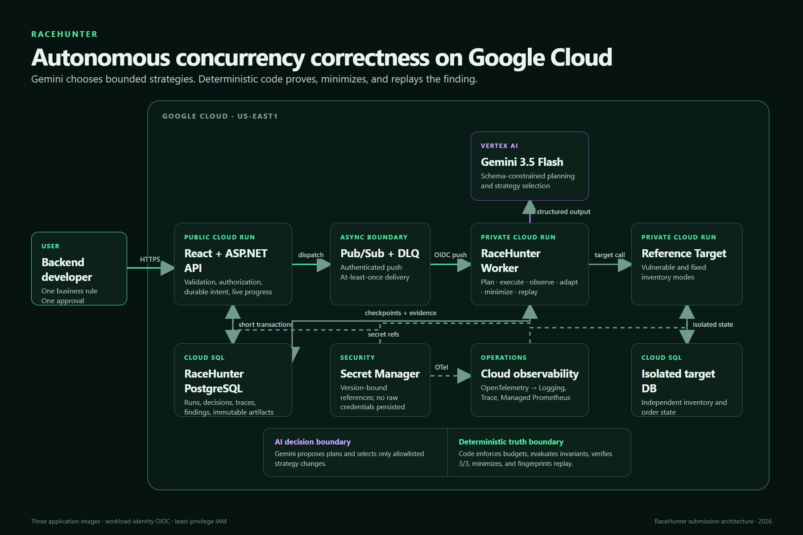

# RaceHunter

> Give it one business invariant. RaceHunter plans a bounded concurrency
> campaign, runs it asynchronously, proves the race deterministically, minimizes
> the schedule, and verifies the fix.

[](https://github.com/alex-luy-assoc/RaceHunter/actions/workflows/ci.yml)
[](https://dotnet.microsoft.com/)
[](https://cloud.google.com/)
[](LICENSE)

**All Things Agentic track:** Taskmaster — a complete autonomous workflow, not
a chatbot.



## Why RaceHunter

Concurrency bugs hide inside code that looks correct in a single request. A
backend developer normally has to invent load tests, choose interleavings,
inspect noisy logs, reproduce the failure, and reduce it by hand. RaceHunter
turns that chore into one approval-gated workflow:

1. The developer writes a plain-language rule such as “successful orders must
   not exceed available inventory.”
2. **Gemini 3.5 Flash** proposes a schema-constrained plan and selects only
   allowlisted strategy changes.
3. The API persists the intent and dispatches work through Pub/Sub.
4. A private worker executes bounded deterministic probes against the target.
5. Code—not the model—evaluates the invariant and requires repeatable evidence.
6. RaceHunter reproduces 3/3, minimizes to the smallest failure-preserving
   schedule, fingerprints the artifact, and replays the fixed mode.
7. The UI rehydrates the run, causal timeline, agent activity, Cloud Proof, and
   vulnerable `Fail` versus fixed `Pass` comparison from PostgreSQL.

The browser can close at any point. Durable checkpoints, inbox/outbox
idempotency, leases, stable receiver keys, cumulative budgets, and monotonic run
state let the campaign recover without pretending an ambiguous mutation is safe.

## Judge-ready proof

| Criterion | RaceHunter evidence |
|---|---|
| **Innovation & operational utility — 40%** | One invariant and one approval drive planning, execution, observation, adaptation, reproduction, minimization, and Verify Fix. The agent changes external state through bounded tools instead of merely generating text. |
| **Architectural discipline — 30%** | Clean Architecture, private worker/target services, Pub/Sub + DLQ, separate Cloud SQL databases, durable inbox/outbox and checkpoints, exact-audience OIDC, Secret Manager version pinning, deterministic truth boundary, hard request/time/model budgets, and fail-closed recovery. |
| **Demo & production readiness — 30%** | Reproducible Compose setup, immutable Docker images, Terraform for Cloud Run/SQL/Pub/Sub/Secret Manager/observability, a clean architecture diagram, environment-qualified evidence, and browser acceptance tests. The remaining video gap is disclosed below. |

### Mandatory Google stack

- **Model:** `gemini-3.5-flash` on Vertex AI.
- **Google agent framework:** the official **Google GenAI SDK** for .NET
  (`Google.GenAI`), with JSON-schema-constrained planning and strategy output.
- **Google Cloud:** Cloud Run, Cloud SQL for PostgreSQL, Pub/Sub + DLQ, Secret
  Manager, Vertex AI, Cloud Trace, Cloud Logging, and Managed Service for
  Prometheus.

See the sanitized [staging evidence](docs/demo/staging-evidence.md), the
[submission checklist](docs/demo/submission-checklist.md), and the
[four-minute demo script](docs/demo/demo-script.md).

## Quick start

### Prerequisites

- Git
- Docker Desktop with Compose
- Optional for source builds: .NET SDK `10.0.400` and Node.js 22+

### Run the complete local stack

```powershell
git clone https://github.com/alex-luy-assoc/RaceHunter.git
cd RaceHunter
docker compose up --build
```

Open <http://localhost:8080/hunts/new>. Worker and reference-target health are
available at <http://localhost:8081/healthz> and
<http://localhost:8082/healthz>.

The local stack uses emulated planning and Pub/Sub so it needs no Google
credentials. It includes the API/React UI, worker, vulnerable/fixed reference
target, PostgreSQL databases, and Pub/Sub emulator.

To stop the stack:

```powershell
docker compose down
```

### Build and test from source

```powershell
dotnet restore RaceHunter.slnx
dotnet build RaceHunter.slnx -c Release --no-restore
dotnet test RaceHunter.slnx -c Release --no-build

npm ci --prefix src/RaceHunter.Web
npm test --prefix src/RaceHunter.Web
npm run lint --prefix src/RaceHunter.Web
npm run build --prefix src/RaceHunter.Web

npm ci --prefix tests/RaceHunter.AcceptanceTests
npm test --prefix tests/RaceHunter.AcceptanceTests -- --config playwright.config.ts
docker compose config --quiet
pwsh ./scripts/audit-public-release.ps1
```

Docker is required for the PostgreSQL Testcontainers suites. Run
`./scripts/run-real-playwright.ps1` for the isolated, non-mocked browser journey
through the UI, API, worker, target, PostgreSQL, and Pub/Sub emulator.

## Architecture

```text
Browser
  │ HTTPS
  ▼
Public React + ASP.NET API ── durable intent ── RaceHunter PostgreSQL
  │
  └─ Pub/Sub + DLQ ── exact-audience OIDC ──► Private Worker
                                                   │
                  Vertex AI / Gemini 3.5 Flash ◄──┤ schema output
                                                   │ identity token
                                                   ▼
                                         Private Reference Target
                                                   │
                                                   ▼
                                         Isolated target PostgreSQL
```

The model is inside an **AI decision boundary**: it proposes plans and bounded
strategy changes. A separate **deterministic truth boundary** enforces budgets,
extracts typed observations, evaluates invariants, promotes findings, minimizes
schedules, and fingerprints replay artifacts. Model text can explain evidence;
it cannot create it.

More detail:

- [System context](docs/architecture/system-context.md)
- [Trust, cost, and authentication boundaries](docs/architecture/system-context.md#trust-and-cost-boundaries)
- [Provisioning and release boundaries](docs/architecture/system-context.md#provisioning-boundaries)
- [Telemetry correlation path](docs/architecture/system-context.md#correlation-path)

## Security model

RaceHunter is for systems you own or are explicitly authorized to test.

- The public sandbox exposes no arbitrary-target configuration. Manual targets
  are Development-only by default and owner-scoped when enabled.
- Destinations are HTTPS-only outside Development, host/port allowlisted,
  DNS/IP validated, redirect-blocked, proxy-bypassed, and restricted to explicit
  methods, paths, templates, observations, and budgets.
- Secrets are references, never request values. Sensitive headers and configured
  JSON paths are redacted before persistence or model use.
- Cloud Run uses dedicated service accounts, no service-account keys, exact
  OIDC audiences, resource-scoped Secret Manager access, deletion protection,
  and hard scale/cost ceilings.
- Ambiguous mutations stop automatic recovery unless a receiver-keyed operation
  can safely reuse the same idempotency key.
- `scripts/audit-public-release.ps1` scans reachable file history, commit and
  annotated-tag messages, the staged index, and public working-tree candidates
  for sensitive paths and high-confidence credential shapes without printing
  matched values. Oversized working candidates fail closed.

Please report vulnerabilities privately as described in [SECURITY.md](SECURITY.md).

## Repository map

| Path | Purpose |
|---|---|
| `src/RaceHunter.Api` | Public HTTP API and React host |
| `src/RaceHunter.Worker` | Private autonomous campaign runtime |
| `src/RaceHunter.Gemini` | Google GenAI SDK adapter and schemas |
| `src/RaceHunter.Application` | Use cases, ports, and deterministic orchestration contracts |
| `src/RaceHunter.Domain` | Invariants, budgets, schedules, findings, and replay models |
| `src/RaceHunter.Infrastructure` | PostgreSQL, Pub/Sub, Secret Manager, identity, and telemetry adapters |
| `src/RaceHunter.ReferenceTarget` | Controlled vulnerable/fixed inventory service |
| `src/RaceHunter.Web` | React user experience |
| `deploy/terraform` | Cloud Run, Cloud SQL, Pub/Sub, IAM, secrets, budget, and observability |
| `tests` | Unit, integration, architecture, security, and Playwright evidence |

## Google Cloud deployment

The checked-in Terraform is split into a protected foundation root and an
application root. External release stages are default-denied and hash-bound to
the exact project, region, commit, image digests, variables, and saved plan.
Raw credentials, state, plans, generated variables, logs, traces, and demo video
remain gitignored.

Start with the credential-free status and qualification commands documented in
the [staging evidence](docs/demo/staging-evidence.md). Do not run billable or
mutation stages without reviewing the scripts and supplying your own explicit
approval for a non-production project.

## Known submission gap

The Google Cloud deployment, route validation, automated smoke, deterministic
finding, Verify Fix replay, and recovery recordings are complete. The retained
browser artifacts are two separate unedited recovery recordings, not one
uninterrupted New Hunt → Verify Fix take. The final All Things Agentic submission
still needs one fresh public video under four minutes that shows the full live
journey and visible Google Cloud proof. This repository does not overstate that
missing evidence.

## License

[MIT](LICENSE) © 2026 Alex Luy.
