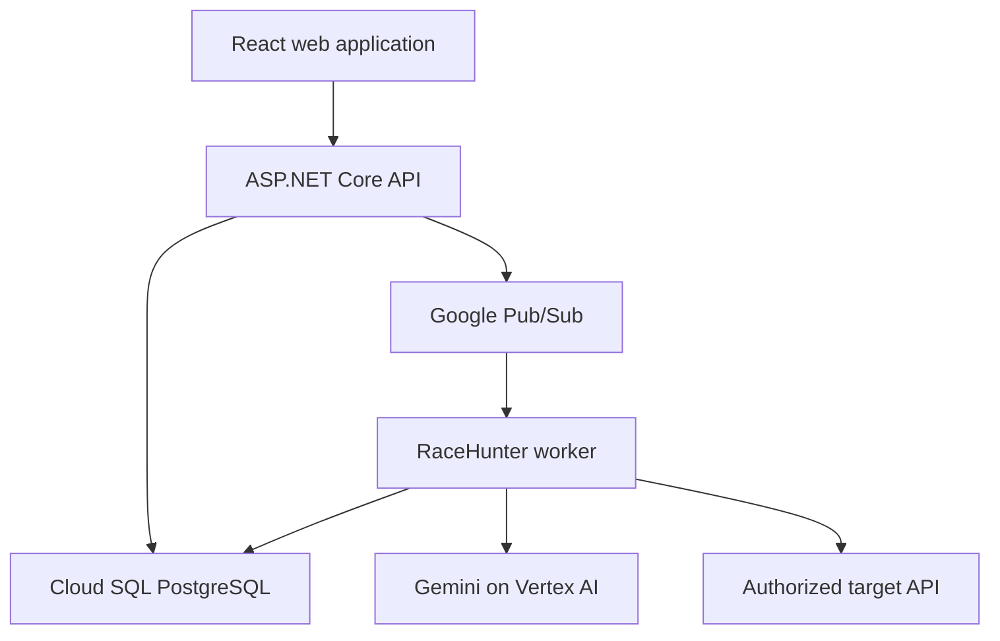

# RaceHunter Project Brief and Technical Specification

**Document purpose:** Seed document for the ALA Memory Bank. Use this document to initialize the project, establish architectural constraints, and decompose the product into roadmap features and implementation tasks.

**Working product name:** RaceHunter  
**Product category:** Autonomous concurrency correctness testing  
**Hackathon track:** Taskmaster  
**Primary implementation language:** C# / .NET 10  
**Database:** PostgreSQL  
**Required AI model:** Gemini 3.5 Flash or newer through Vertex AI  
**Google agent framework:** Google Gen AI SDK for .NET (`Google.GenAI`)  
**Google Cloud infrastructure:** Cloud Run, Pub/Sub, Cloud SQL for PostgreSQL, Secret Manager, Cloud Logging and Trace

---

## 1. Instructions for the Memory Bank

Treat the decisions marked **Required** in this document as approved project constraints. Do not silently replace them during roadmap or implementation work.

When producing the roadmap:

1. Decompose the feature candidates into independently demonstrable vertical slices.
2. Identify dependencies and the critical path.
3. Assign each feature an MVP, stretch, or post-hackathon priority.
4. Evaluate complexity, architectural risk, testing difficulty, and demo value.
5. Produce explicit acceptance criteria for every feature.
6. Keep infrastructure, testing, observability, security, and documentation work visible; do not hide them inside a generic “technical work” feature.
7. Do not add capabilities listed under Non-Goals to the MVP.
8. Request approval before changing an approved architecture decision.

Each generated feature specification should contain:

- Objective and user value
- User stories or use cases
- Functional requirements
- Non-functional requirements
- Domain model changes
- API and event contract changes
- Persistence changes and migrations
- UI changes
- Security and abuse-prevention considerations
- Observability requirements
- Unit, integration, concurrency, and acceptance tests
- Dependencies and sequencing
- Definition of done

---

## 2. Product Description

### 2.1 One-sentence description

RaceHunter is an autonomous developer tool that plans and executes concurrent API experiments to find business-level race conditions, explain the causal sequence, minimize the failure, and generate a replayable regression test.

### 2.2 Elevator pitch

Traditional load-testing tools answer whether an application remains fast under traffic. RaceHunter answers a different question: **does the application remain correct when multiple users perform conflicting actions at the same time?**

A developer supplies an API definition, setup data, and business rules such as “inventory must never become negative” or “a coupon may be redeemed only once.” Gemini produces candidate multi-user scenarios and an experiment strategy. A deterministic .NET concurrency engine executes controlled schedules with bounded parallelism, records a causal trace, and evaluates the defined invariants. When a failure is found, RaceHunter reduces it to the smallest useful reproduction and lets the developer replay it against a fix.

### 2.3 Problem statement

Business race conditions are difficult to discover because they require a precise and often rare interleaving of otherwise valid operations. Conventional unit tests are usually sequential. Load tests focus on throughput and latency rather than correctness. Logs from nondeterministic failures are difficult to correlate, and a failure observed once may be hard to reproduce.

Examples include:

- Two customers purchasing the last item
- Two users reserving the same appointment or seat
- The same coupon, gift card, or credit being redeemed twice
- Duplicate records created from simultaneous requests
- A resource moving through invalid state transitions
- Multiple workers processing the same logical command
- A stale read overwriting a newer update

### 2.4 Proposed solution

RaceHunter combines two complementary systems:

1. **Gemini reasoning layer:** Understands API descriptions and business rules, proposes high-value scenarios, selects subsequent experiments from observed evidence, and explains findings.
2. **Deterministic execution layer:** Controls actor concurrency, applies bounded scheduling strategies, captures structured evidence, evaluates invariants, and replays recorded schedules.

Gemini must never be responsible for low-level synchronization or be treated as the source of truth for whether an invariant passed. Deterministic application code owns execution, validation, persistence, and replay.

### 2.5 Product positioning

RaceHunter is not:

- A general-purpose load-testing platform
- A source-code thread race detector
- A vulnerability scanner for arbitrary public targets
- A replacement for unit, integration, or performance testing
- A guarantee that all possible interleavings have been explored

RaceHunter is an API-level concurrency correctness testing platform that explores bounded schedules and produces evidence-backed findings.

---

## 3. Target Users and Primary Jobs

### 3.1 Primary users

- Backend developers implementing transactional workflows
- QA and test-automation engineers
- Platform and reliability engineers
- Architects reviewing distributed workflows
- Engineering teams diagnosing intermittent production defects

### 3.2 Primary jobs to be done

1. Turn a business rule into executable concurrency invariants.
2. Generate meaningful multi-user scenarios from an API contract.
3. Run concurrency experiments without writing a custom harness for each case.
4. See the exact request and state sequence that caused a failure.
5. Convert an intermittent failure into a small replayable test.
6. Verify that a code or database fix prevents the same failure.

---

## 4. Goals, Success Criteria, and Non-Goals

### 4.1 Hackathon MVP goals

- Import or manually define a small HTTP/JSON target API.
- Express at least three types of business invariants.
- Use Gemini 3.5 Flash or newer to generate structured concurrency scenarios.
- Autonomously run a bounded plan-execute-observe-adapt loop.
- Execute concurrent actors with configurable global and per-target limits.
- Record a schedule seed and a structured causal trace.
- Detect at least one real invariant violation in the included reference application.
- Reduce a failing experiment to a minimal useful reproduction.
- Replay the minimized experiment against vulnerable and fixed implementations.
- Deploy the application to Google Cloud and visibly demonstrate the deployment.

### 4.2 Demo success criteria

The golden-path demo must:

1. Start with an item containing one unit of inventory.
2. Ask RaceHunter to test the rule: “Successful orders must not exceed available inventory.”
3. Show Gemini generate or refine a multi-buyer scenario.
4. Run multiple schedules through the concurrency engine.
5. Produce an evidence-backed oversell finding.
6. Reduce the result to two buyers and the minimum necessary steps.
7. Display a causal timeline and a replay identifier.
8. Enable a transactionally correct implementation in the reference target.
9. Replay the same test and show that the invariant passes.

### 4.3 MVP performance targets

- Support at least 100 logical actors in a bounded experiment.
- Allow global and per-target concurrency to be configured independently.
- Persist run progress without loading the full trace into memory.
- Begin cancellation within two seconds of a user cancellation request.
- Resume the UI from persisted state after a page refresh.
- Prevent duplicate Pub/Sub delivery from creating a second logical execution.

These are engineering targets, not public service-level guarantees.

### 4.4 Non-goals for the hackathon

- Automatic modification of the target system’s source code
- Browser-based UI concurrency testing
- Production traffic interception or packet capture
- Arbitrary database access to the target system
- Kubernetes or multi-region deployment
- Enterprise multi-tenancy and billing
- Exhaustive formal verification of all schedules
- Support for protocols other than HTTP/JSON
- Support for untrusted public targets
- Automatic CI pull-request commenting
- A marketplace of reusable test scenarios

---

## 5. Product Principles

1. **Evidence before explanation:** A finding requires a deterministic invariant result and supporting trace. Gemini explanations alone are not findings.
2. **Bounded autonomy:** Every campaign has explicit limits for actors, concurrency, requests, iterations, time, Gemini usage, and target hosts.
3. **Safe by default:** Only explicitly authorized and allowlisted targets may be tested.
4. **Reproducibility is measured:** Record schedule seeds and report replay success rate. Do not call an external-system failure deterministic unless repeated evidence supports that claim.
5. **Model-independent core:** The execution engine, domain model, and invariant evaluator must run without Gemini.
6. **Structured model interaction:** Gemini inputs and outputs use versioned schemas. Free-form text is explanatory, not executable.
7. **Production-minded simplicity:** Prefer a modular monolith and explicit boundaries until scale or operational evidence justifies additional services.

---

## 6. Technical Architecture

### 6.1 Architecture style

**Required:** Use a modular monolith organized with Clean Architecture boundaries. Deploy the HTTP API and execution worker as separate Cloud Run processes from the same solution and shared application/domain libraries.

This provides operational separation for long-running experiments without introducing distributed business logic across multiple independently evolving services.

### 6.2 System context



### 6.3 Main deployable components

#### RaceHunter Web

- React and TypeScript
- Experiment creation and review
- Live run progress
- Trace timeline and finding evidence
- Replay and verify-fix actions
- Communicates only with RaceHunter API

#### RaceHunter API

- ASP.NET Core Web API on .NET 10
- Authentication and authorization boundary
- Target, experiment, run, finding, and replay endpoints
- Application command/query handlers
- Publishes execution requests to Pub/Sub
- Provides Server-Sent Events or SignalR progress streaming
- Does not execute long-running test campaigns inside HTTP request handlers

#### RaceHunter Worker

- .NET Worker Service hosted on Cloud Run
- Receives idempotent experiment-run messages from Pub/Sub
- Runs the autonomous experiment loop
- Invokes Gemini through an injected abstraction
- Executes the concurrency engine
- Evaluates invariants and minimizes failures
- Persists progress incrementally
- Honors cancellation and experiment budgets

#### Reference Target API

- Small ASP.NET Core API used only for demonstration and acceptance testing
- Provides an inventory/order workflow with vulnerable and fixed modes
- Uses its own PostgreSQL schema or database
- Includes deterministic test reset and seed endpoints restricted to development/demo environments
- Produces correlation identifiers in responses

### 6.4 Proposed solution structure

```text
src/
  RaceHunter.Domain/
  RaceHunter.Application/
  RaceHunter.Contracts/
  RaceHunter.Infrastructure/
  RaceHunter.Concurrency/
  RaceHunter.Gemini/
  RaceHunter.Api/
  RaceHunter.Worker/
  RaceHunter.ReferenceTarget/
  RaceHunter.Web/
tests/
  RaceHunter.Domain.Tests/
  RaceHunter.Application.Tests/
  RaceHunter.Concurrency.Tests/
  RaceHunter.Infrastructure.IntegrationTests/
  RaceHunter.Api.IntegrationTests/
  RaceHunter.ReferenceTarget.Tests/
  RaceHunter.Architecture.Tests/
  RaceHunter.AcceptanceTests/
deploy/
  cloud-run/
  database/
docs/
  architecture/
  decisions/
  demo/
```

---

## 7. Mandatory Engineering Standards

### 7.1 SOLID principles

All production code must follow SOLID principles:

- **Single Responsibility:** Separate planning, scheduling, execution, invariant evaluation, trace storage, minimization, and explanation.
- **Open/Closed:** Add scheduling strategies, invariant evaluators, target adapters, and AI providers through new implementations rather than modifying central switch statements.
- **Liskov Substitution:** Implementations must honor interface contracts, cancellation, error semantics, and idempotency guarantees.
- **Interface Segregation:** Prefer focused interfaces such as `IScenarioPlanner` and `IInvariantEvaluator` over a large “RaceHunterService.”
- **Dependency Inversion:** Domain and Application layers depend on abstractions. Infrastructure, Gemini, Pub/Sub, PostgreSQL, and HTTP concerns implement those abstractions.

### 7.2 Dependency injection

**Required:** Use the built-in .NET dependency injection container at each composition root.

- Constructor injection is the default.
- Do not use service locator patterns.
- Do not resolve services from `IServiceProvider` inside application/domain logic.
- Use appropriate lifetimes and validate scopes during startup.
- External clients are registered through typed clients or focused factories.
- Time, identifiers, randomness, and model invocation are injectable abstractions when required for deterministic tests.

Candidate abstractions include:

- `IExperimentRepository`
- `IRunRepository`
- `IFindingRepository`
- `IUnitOfWork`
- `IExperimentQueue`
- `ITargetClientFactory`
- `IScenarioPlanner`
- `IExperimentStrategist`
- `IFailureAnalyst`
- `IConcurrencyScheduler`
- `IInvariantEvaluator`
- `IReproductionMinimizer`
- `IClock`
- `IRandomSource`
- `ISecretProvider`

### 7.3 Repository pattern

**Required:** Use aggregate-specific repository interfaces owned by the Application or Domain layer and implemented in Infrastructure.

- Do not expose `DbContext`, `DbSet`, or `IQueryable` outside Infrastructure.
- Do not build a generic repository that merely mirrors every EF Core method.
- Repositories must reflect domain operations and aggregate boundaries.
- Use dedicated read/query services for projections and paginated UI queries.
- Use `IUnitOfWork` for explicit transactional commits across repository operations.
- Keep transactions short and never hold a database transaction open during an HTTP or Gemini call.
- Use optimistic concurrency tokens for mutable aggregates.

### 7.4 PostgreSQL and data access

**Required:** PostgreSQL is the system of record. Use Cloud SQL for PostgreSQL in Google Cloud and Dockerized PostgreSQL locally.

- Use EF Core with the Npgsql provider.
- Use LINQ and strongly typed mappings.
- No inline SQL in controllers, handlers, services, repositories, or tests.
- Do not concatenate SQL or allow user values to become SQL fragments.
- Manage schema changes through versioned EF Core migrations.
- Use `jsonb` only for genuinely variable payloads such as sanitized request bodies, response bodies, trace metadata, and versioned model output.
- Store relationships and query-critical properties in normalized columns.
- Use `timestamptz` semantics and UTC throughout the application.
- Prefer UUID identifiers generated by the application.
- Add indexes from demonstrated query and integrity requirements, not speculation.

### 7.5 Asynchronous programming

**Required:** All I/O paths must be asynchronous end to end.

- Use `async`/`await` for database, HTTP, Pub/Sub, Gemini, and streaming operations.
- Every long-running public operation accepts and propagates `CancellationToken`.
- Do not use `.Result`, `.Wait()`, `async void`, or sync-over-async.
- Do not wrap asynchronous I/O in `Task.Run`.
- Use bounded `System.Threading.Channels` for in-process work queues.
- Use `SemaphoreSlim` or dedicated limiters for global and per-target concurrency.
- Use `IHttpClientFactory` and streaming HTTP APIs where appropriate.
- Apply timeouts at operation and campaign levels.
- Avoid unbounded `Task.WhenAll` over user-controlled collections.
- Persist progress in batches so a process restart does not erase the entire run.

### 7.6 Extensibility

Use explicit extension points for:

- Scheduling strategies
- Invariant types
- Target protocols and authentication methods
- Scenario importers
- AI providers and model versions
- Trace sinks
- Report exporters
- Queue implementations

Registration should be declarative through dependency injection. Avoid reflection-driven plugin systems in the MVP.

### 7.7 Coding standards

- Nullable reference types enabled
- Treat compiler warnings as errors in production projects
- Central package version management
- EditorConfig and automated formatting
- XML documentation for public contracts and non-obvious algorithms
- No business logic in controllers, EF entities’ mapping configuration, or React components
- No static mutable state
- No secrets in source control, logs, traces, or persisted request headers
- Prefer immutable records for commands, events, configuration snapshots, and trace entries
- Validate all boundary inputs

---

## 8. Domain Model

### 8.1 Core aggregates and entities

#### Project

Groups target systems, experiments, runs, and findings.

Key fields:

- `ProjectId`
- `Name`
- `Description`
- `CreatedAt`
- `UpdatedAt`
- `Version`

#### TargetSystem

Represents an explicitly authorized system under test.

Key fields:

- `TargetSystemId`
- `ProjectId`
- `Name`
- `BaseUri`
- `AuthorizationStatus`
- `AuthenticationConfigurationReference`
- `GlobalRequestLimit`
- `MaximumConcurrency`
- `AllowedHosts`
- `CreatedAt`
- `Version`

Secret values must not be stored directly in this aggregate.

#### Experiment

Defines the testing objective, scenarios, invariants, and execution budget.

Key fields:

- `ExperimentId`
- `ProjectId`
- `TargetSystemId`
- `Name`
- `Objective`
- `Status`
- `ScenarioDefinitionVersion`
- `Budget`
- `CreatedAt`
- `UpdatedAt`
- `Version`

#### ScenarioDefinition

Versioned definition of actors, setup steps, concurrent operations, observation steps, and cleanup.

#### InvariantDefinition

Versioned machine-evaluable rule that determines correctness.

Initial invariant types:

- Numeric boundary
- Uniqueness/cardinality
- Allowed state transition
- Exactly-once/idempotency
- Response/state relationship

#### ExperimentRun

Represents one autonomous campaign and owns its lifecycle.

Key fields:

- `ExperimentRunId`
- `ExperimentId`
- `Status`
- `RequestedAt`
- `StartedAt`
- `CompletedAt`
- `CancellationRequestedAt`
- `BudgetSnapshot`
- `CurrentIteration`
- `FailureSummary`
- `Version`

#### RunAttempt

Represents one concrete schedule executed within a campaign.

Key fields:

- `RunAttemptId`
- `ExperimentRunId`
- `IterationNumber`
- `ScheduleStrategy`
- `ScheduleSeed`
- `ActorCount`
- `StartedAt`
- `CompletedAt`
- `Outcome`
- `ReplaySuccessRate`

#### TraceEvent

Append-only evidence emitted during execution.

Key fields:

- `TraceEventId`
- `RunAttemptId`
- `SequenceNumber`
- `OccurredAt`
- `ActorId`
- `StepId`
- `EventType`
- `CorrelationId`
- `Duration`
- `SanitizedPayload`
- `ErrorClassification`

#### Finding

Represents a verified invariant violation.

Key fields:

- `FindingId`
- `ExperimentRunId`
- `InvariantDefinitionId`
- `Severity`
- `Title`
- `EvidenceSummary`
- `MinimalReproductionId`
- `FirstObservedAt`
- `Status`
- `Version`

#### ReplayArtifact

Immutable, versioned reproduction containing scenario version, invariant version, target snapshot, schedule seed, required setup, and sanitized request data.

#### AgentIteration

Audit record of the autonomous loop, including input evidence references, selected action, rationale summary, model identifier, schema version, token usage, and timestamps.

### 8.2 Suggested PostgreSQL tables

- `projects`
- `target_systems`
- `target_endpoints`
- `experiments`
- `scenario_definitions`
- `scenario_actors`
- `scenario_steps`
- `invariant_definitions`
- `experiment_runs`
- `run_attempts`
- `actor_executions`
- `step_executions`
- `trace_events`
- `findings`
- `replay_artifacts`
- `agent_iterations`
- `inbox_messages`
- `outbox_messages`

Use inbox/idempotency records to tolerate Pub/Sub’s at-least-once delivery. Use an outbox where a state transition and event publication must be atomic.

---

## 9. Concurrency Execution Engine

### 9.1 Responsibilities

The engine must:

- Materialize a validated scenario into actor work plans.
- Enforce global, per-target, and per-experiment limits.
- Coordinate actors with barriers and gates.
- Apply a selected scheduling strategy and seeded randomness.
- Capture ordered trace events without blocking actor execution unnecessarily.
- Propagate cancellation and deadlines.
- Isolate actor failures and classify transport, target, assertion, and orchestration errors.
- Return structured attempt results to the autonomous loop.

### 9.2 Initial scheduling strategies

1. **Simultaneous start:** All selected operations wait at a barrier and release together.
2. **Staggered start:** Actors start with controlled fixed offsets.
3. **Seeded jitter:** Deterministic pseudorandom delays are applied at configured points.
4. **Burst:** Operations release in bounded groups.
5. **Checkpoint interleaving:** Actors pause after selected steps and are released in a recorded order.

### 9.3 Backpressure and concurrency balancing

- Use a bounded channel for pending actor operations.
- Apply a global concurrency limiter to protect the worker.
- Apply a target-specific limiter to respect user configuration.
- Apply an experiment limiter to prevent one campaign from monopolizing the worker.
- Reject or delay work when budgets are exhausted; never create unbounded queues.
- Record queue time separately from target latency.
- Make fairness policy explicit and testable.

### 9.4 Replay semantics

A replay contains the scenario and invariant versions, schedule strategy, seed, actor count, timing offsets, request templates, and target configuration snapshot.

For external target APIs, replay is best-effort because the server’s internal scheduling cannot be controlled. Report the number of successful reproductions over total replay attempts. For the included reference target, controlled checkpoints may be used to produce a reliable demonstration.

---

## 10. Gemini Agent Design

### 10.1 Required Gemini responsibilities

Gemini must contribute materially to the deployed product by:

- Translating a business objective and API description into candidate scenarios.
- Proposing machine-evaluable invariant definitions for user confirmation.
- Selecting the next experiment strategy from prior attempt evidence.
- Explaining an evidence-backed violation in developer-friendly terms.
- Suggesting minimization priorities while deterministic code validates each reduction.

### 10.2 Autonomous loop

```text
Validate objective and authorization
  -> Generate initial scenarios and invariants
  -> Execute bounded attempt
  -> Evaluate invariants deterministically
  -> Summarize evidence
  -> Gemini selects next action
  -> Execute, refine, minimize, or stop
  -> Persist final finding and replay artifact
```

### 10.3 Stop conditions

The loop must stop when any configured limit is reached:

- Finding is reproduced and minimized sufficiently
- Maximum iterations
- Maximum requests
- Maximum elapsed duration
- Maximum actor count
- Gemini token or monetary budget
- Target error threshold
- User cancellation
- Authorization or safety violation
- No meaningful new strategy remains

### 10.4 Gemini integration constraints

- Use the official Google Gen AI .NET SDK behind an `IGeminiClient` or model-provider abstraction.
- Use Vertex AI credentials and workload identity in Google Cloud.
- Require structured JSON output with a versioned JSON schema.
- Validate every response before it can influence execution.
- Reject unknown endpoint references, invariant types, or scheduling strategies.
- Persist model identifier, prompt/schema version, request correlation, usage, and response outcome.
- Keep prompts in versioned resources rather than inline controller or handler strings.
- Redact credentials and sensitive payloads before model invocation.
- Retry only transient failures using bounded resilience policies.
- Provide a deterministic fake implementation for tests.

### 10.5 Agent application interfaces

```text
IScenarioPlanner
  PlanAsync(PlanningContext, CancellationToken)

IExperimentStrategist
  SelectNextAsync(ExperimentEvidence, ExperimentBudget, CancellationToken)

IFailureAnalyst
  AnalyzeAsync(VerifiedFindingEvidence, CancellationToken)

IReproductionMinimizer
  MinimizeAsync(FailingAttempt, MinimizationBudget, CancellationToken)
```

The minimizer may use Gemini for prioritization, but only deterministic execution may accept or reject a candidate reduction.

---

## 11. Invariant Evaluation

### 11.1 Requirements

- Invariants are versioned and machine-evaluable.
- Every evaluation produces a pass, fail, or inconclusive result with evidence references.
- Evaluators are registered through dependency injection.
- A malformed or unsupported invariant cannot start an experiment.
- Inconclusive results are never reported as defects.
- Model-generated explanations cannot change evaluation results.

### 11.2 Initial evaluators

#### Numeric boundary

Example: remaining inventory must be greater than or equal to zero.

#### Cardinality/uniqueness

Example: at most one active reservation may exist for a seat.

#### State transition

Example: an order may not move from `Completed` back to `Pending`.

#### Exactly-once/idempotency

Example: repeated processing of one idempotency key may create only one order.

#### Cross-observation relationship

Example: successful order count must not exceed initial inventory minus final inventory adjustments.

---

## 12. API Surface

Initial REST resources:

- `POST /api/projects`
- `GET /api/projects/{projectId}`
- `POST /api/projects/{projectId}/targets`
- `POST /api/targets/{targetId}/openapi-imports`
- `POST /api/projects/{projectId}/experiments`
- `POST /api/experiments/{experimentId}/generate-plan`
- `PUT /api/experiments/{experimentId}/scenario`
- `PUT /api/experiments/{experimentId}/invariants`
- `POST /api/experiments/{experimentId}/runs`
- `GET /api/runs/{runId}`
- `POST /api/runs/{runId}/cancel`
- `GET /api/runs/{runId}/events`
- `GET /api/runs/{runId}/trace`
- `GET /api/findings/{findingId}`
- `POST /api/findings/{findingId}/replays`
- `GET /api/replays/{replayId}`

Rules:

- Use versioned request and response contracts.
- Do not expose domain entities directly.
- Validate at the HTTP boundary and again at domain boundaries where invariants apply.
- Return RFC 9457 Problem Details for errors.
- Use idempotency keys for run and replay creation.
- Use cursor-based pagination for event and trace collections.

---

## 13. User Experience

### 13.1 MVP screens

1. **Projects:** Select or create a testing project.
2. **Target setup:** Configure authorized base URL, authentication reference, and limits.
3. **Experiment designer:** Enter the testing objective, review endpoints, generated actors, steps, and invariants.
4. **Live execution:** Display current iteration, actors, concurrency, requests, budget, and cancellation.
5. **Trace timeline:** Show actor lanes, requests, responses, checkpoints, observations, and invariant evaluations.
6. **Finding:** Present the violated rule, evidence, minimal reproduction, replay history, and Gemini explanation.
7. **Verify fix:** Select a target version/configuration and replay the minimized experiment.

### 13.2 UX principles

- Show the user what Gemini generated before the first execution.
- Clearly distinguish observed evidence from AI interpretation.
- Expose concurrency and budget limits.
- Never display secrets or unredacted authorization headers.
- Make cancellation prominent.
- Prefer progressive detail: summary first, trace evidence on demand.

---

## 14. Security and Responsible-Use Requirements

RaceHunter can generate significant traffic and must not become an open stress-testing service.

**Required controls:**

- Require an explicit authorization acknowledgement for every target.
- Allowlist target schemes and hosts.
- Permit HTTPS by default; allow local HTTP only in explicit development mode.
- Resolve and validate destinations to reduce SSRF risk.
- Block cloud metadata endpoints and prohibited address ranges unless an approved local-development policy applies.
- Enforce hard request, actor, concurrency, duration, and retry limits server-side.
- Store credentials in Secret Manager and persist only secret references.
- Redact authorization headers, cookies, tokens, and configured sensitive JSON paths.
- Do not send secrets or unredacted payloads to Gemini.
- Audit target changes, run requests, cancellation, and replay.
- Apply least-privilege service accounts and workload identity.
- Separate reference-target reset endpoints from production configuration.

For the hackathon MVP, restrict use to the included reference target and explicitly configured user-owned targets.

---

## 15. Reliability and Failure Handling

- Pub/Sub messages are at-least-once; execution start must be idempotent.
- A run has an explicit state machine with legal transitions.
- Worker restarts must not silently mark a running campaign successful.
- Use leases/heartbeats or an equivalent ownership mechanism for active runs.
- Persist attempt boundaries and progress checkpoints.
- Classify errors as target, transport, model, persistence, orchestration, cancellation, validation, or invariant failure.
- Retry only transient failures with exponential backoff and jitter.
- Do not retry unsafe target operations unless the scenario supplies an idempotency mechanism.
- Place poison messages in a dead-letter path and surface them operationally.
- Ensure cancellation is idempotent.
- Use database uniqueness constraints as the final enforcement for idempotency records.

### 15.1 Experiment run state machine

```text
Draft -> Queued -> Running -> Minimizing -> Completed
                        |          |
                        v          v
                     Failed     Failed
                        |
                        v
                    Cancelled
```

The implementation must define exact legal transitions. `Completed`, `Failed`, and `Cancelled` are terminal.

---

## 16. Observability

Use OpenTelemetry-compatible tracing, metrics, and structured logs.

### 16.1 Correlation hierarchy

- Project ID
- Experiment ID
- Experiment Run ID
- Run Attempt ID
- Actor ID
- Step ID
- HTTP correlation/request ID
- Gemini invocation ID

### 16.2 Metrics

- Active and queued runs
- Attempts per campaign
- Actor operations queued and active
- Target request latency and error count
- Queue delay
- Invariant evaluations by outcome
- Findings and replay success rate
- Gemini calls, latency, tokens, and failures
- PostgreSQL operation latency
- Pub/Sub delivery and duplicate count
- Cancellation latency

### 16.3 Logging constraints

- Structured logs only for application events.
- Never log secrets or complete authorization data.
- Do not log full payloads by default.
- Sampling may apply to successful low-level events, but finding evidence must remain complete.

---

## 17. Testing Strategy

### 17.1 Unit tests

- Domain state transitions and invariants
- Budget enforcement
- Scheduling decisions with fixed seeds
- Invariant evaluators
- Minimization candidate selection
- Redaction and target validation
- Idempotency behavior

### 17.2 Integration tests

- PostgreSQL repositories and migrations using Testcontainers
- Inbox/outbox behavior
- API endpoints and validation
- Pub/Sub adapter contract using an emulator or controlled test double
- Gemini adapter serialization using deterministic recorded fixtures or fakes
- Reference target vulnerable and fixed modes

### 17.3 Concurrency tests

- Global and per-target concurrency never exceed configured limits
- Bounded channels apply backpressure
- Cancellation releases actors and resources
- No deadlock when one actor fails at a barrier
- Trace sequence numbers are unique and ordered within an attempt
- Same seed produces the same client-side schedule
- Duplicate execution messages do not produce duplicate runs

### 17.4 Architecture tests

- Domain has no dependency on Application or Infrastructure.
- Application has no dependency on Infrastructure, API, Worker, or UI.
- Controllers depend on application abstractions, not repositories or DbContext.
- Infrastructure implementations do not leak provider types through interfaces.
- No forbidden direct construction of external clients.
- No inline SQL API usage in application projects.

### 17.5 Acceptance test

The automated golden path must:

1. Reset the reference target with inventory of one.
2. Create or load the oversell experiment.
3. Execute a bounded campaign.
4. Detect the oversell invariant violation.
5. Produce a replay artifact involving two actors.
6. Reproduce the violation in vulnerable mode.
7. Enable fixed mode.
8. Replay without violating the invariant.

### 17.6 Quality gates

- Build succeeds with warnings treated as errors.
- Unit and integration tests pass.
- Database migrations apply to an empty database.
- Architecture tests pass.
- No secrets are present in the repository or generated artifacts.
- Container images build reproducibly.
- Smoke test succeeds against the deployed Cloud Run environment.

---

## 18. Feature Candidates for Roadmap Decomposition

### RH-001 Solution foundation and architecture enforcement — MVP

Create the .NET solution, project boundaries, dependency rules, shared build configuration, React application, test projects, Docker development environment, and architecture tests.

**Outcome:** A deployable skeleton with enforced dependency direction and health checks.

### RH-002 PostgreSQL persistence foundation — MVP

Implement EF Core/Npgsql configuration, migrations, aggregate-specific repositories, unit of work, normalized schema, optimistic concurrency, and local Testcontainers support.

**Outcome:** Projects, targets, experiments, runs, and findings can be stored and queried without inline SQL.

### RH-003 Reference inventory/order target — MVP

Build the vulnerable and fixed order workflow, reset/seed operations, correlation identifiers, and acceptance fixtures.

**Outcome:** The project has a safe and reproducible race-condition target for the demo.

### RH-004 Target registration and safety controls — MVP

Implement authorized target registration, host allowlisting, authentication secret references, target limits, URL validation, SSRF protections, and redaction configuration.

**Outcome:** RaceHunter cannot freely direct traffic to arbitrary targets.

### RH-005 Scenario and invariant designer — MVP

Implement versioned scenario actors/steps, experiment budgets, invariant definitions, validation, editing APIs, and the corresponding UI.

**Outcome:** A developer can manually define a complete executable experiment.

### RH-006 OpenAPI import — Stretch for hackathon

Import selected HTTP operations from OpenAPI, normalize them into target endpoint definitions, and let the user review supported and unsupported constructs.

**Outcome:** The user does not need to enter every endpoint manually.

### RH-007 Gemini scenario planner — MVP

Integrate Gemini 3.5 Flash or newer through Vertex AI using the Google Gen AI .NET SDK. Generate schema-constrained actors, steps, invariants, and strategy proposals.

**Outcome:** Gemini materially transforms a business objective into an executable concurrency plan.

### RH-008 Concurrency scheduler and actor runtime — MVP

Implement bounded channels, concurrency limiters, barriers, seeded scheduling, actor execution, cancellation, and error isolation.

**Outcome:** RaceHunter can execute controlled concurrent HTTP operations safely.

### RH-009 Trace capture and live run progress — MVP

Persist structured trace events incrementally and stream summarized progress to the UI.

**Outcome:** Users can observe the campaign and inspect causal evidence after completion.

### RH-010 Deterministic invariant evaluation — MVP

Implement the initial invariant evaluator registry and evidence-backed pass/fail/inconclusive results.

**Outcome:** Correctness is decided by code rather than model interpretation.

### RH-011 Autonomous experiment strategist — MVP

Implement the bounded plan-execute-observe-adapt loop, Gemini strategy selection, budget tracking, stop conditions, and agent audit records.

**Outcome:** RaceHunter performs a multi-step testing campaign with limited user intervention.

### RH-012 Failure minimization — MVP

Use deterministic reduction attempts to remove actors, steps, delays, and schedule complexity while preserving the violation. Gemini may prioritize candidates.

**Outcome:** A large failure becomes a small useful reproduction.

### RH-013 Replay and verify-fix workflow — MVP

Create immutable replay artifacts, repeated replay measurement, replay APIs, finding linkage, and verify-fix UI.

**Outcome:** Users can reproduce a defect and demonstrate that a fix works.

### RH-014 Findings and causal timeline UI — MVP

Build a finding summary, evidence viewer, actor-lane timeline, Gemini explanation, replay controls, and vulnerable-versus-fixed comparison.

**Outcome:** A judge or developer can understand the defect quickly.

### RH-015 Asynchronous run dispatch — MVP

Implement Pub/Sub publishing/consumption, inbox idempotency, run ownership, progress checkpoints, cancellation, and dead-letter handling.

**Outcome:** Long-running work is separated from the request/response lifecycle and tolerates duplicate delivery.

### RH-016 Google Cloud deployment and observability — MVP

Deploy API, worker, reference target, web application, Cloud SQL, Pub/Sub, Secret Manager integration, logging, tracing, dashboards, and cost controls.

**Outcome:** The repository and demo provide visible proof that RaceHunter runs on Google Cloud.

### RH-017 Submission package — MVP

Produce architecture diagrams, setup/deployment instructions, seed scripts, demo script, test evidence, screenshots, and the approximately four-minute video.

**Outcome:** Judges can understand, reproduce, and evaluate the project.

### RH-018 Exportable regression tests — Post-hackathon

Generate xUnit or language-neutral replay fixtures from a minimized finding.

### RH-019 CI/CD integration — Post-hackathon

Run approved experiments in CI and publish findings without exposing target credentials.

### RH-020 Additional correctness patterns — Post-hackathon

Add lost-update, double-spend, distributed idempotency, reservation, workflow-saga, and eventual-consistency scenario libraries.

### RH-021 Multi-tenant SaaS controls — Post-hackathon

Add organizations, roles, quotas, billing, tenant isolation, and audit administration.

---

## 19. Recommended Release Sequence

### Release 0.1 — Walking skeleton

- RH-001 Solution foundation
- RH-002 Persistence foundation
- RH-003 Reference target
- Basic Cloud Run and PostgreSQL smoke deployment from RH-016

**Exit:** One API request reaches a deployed service, persists data, and the reference target can be reset.

### Release 0.2 — Manual race execution

- RH-004 Target safety
- RH-005 Scenario/invariant designer
- RH-008 Concurrency runtime
- RH-009 Trace capture
- RH-010 Invariant evaluation

**Exit:** A manually defined two-buyer scenario detects overselling and produces trace evidence without Gemini.

### Release 0.3 — Required agentic behavior

- RH-007 Gemini planner
- RH-011 Autonomous strategist

**Exit:** Gemini generates a valid scenario and autonomously chooses at least one follow-up experiment based on evidence.

### Release 0.4 — Reproduction and product experience

- RH-012 Failure minimization
- RH-013 Replay/verify fix
- RH-014 Findings UI

**Exit:** The end-to-end vulnerable-versus-fixed demo works reliably.

### Release 0.5 — Production and submission hardening

- RH-015 Asynchronous dispatch
- Complete RH-016 deployment/observability
- RH-017 submission package
- RH-006 OpenAPI import only if critical path is complete

**Exit:** Cloud deployment, documentation, tests, architecture diagram, and video are submission-ready.

---

## 20. Definition of Done for MVP

RaceHunter MVP is complete when:

- The golden-path acceptance test passes locally and against Google Cloud.
- Gemini 3.5 Flash or newer is visibly used in the deployed autonomous loop.
- At least one Google agent framework and Google Cloud infrastructure service are demonstrably used.
- The concurrency engine enforces bounded global and target-level concurrency.
- PostgreSQL stores all durable domain state through repositories and EF Core migrations.
- There is no inline SQL in the application.
- The vulnerable reference target produces an evidence-backed finding.
- The minimizer produces a two-actor replay artifact.
- The same artifact fails against vulnerable mode and passes against fixed mode.
- Cancellation, duplicate message delivery, and worker failure paths are tested.
- Secrets and sensitive target data are protected and redacted.
- Architecture and quality gates pass.
- The README contains local and Google Cloud setup instructions.
- The architecture diagram shows Gemini, the .NET components, PostgreSQL, Pub/Sub, Cloud Run, and the target system.
- The demonstration can be completed reliably within four minutes.

---

## 21. Approved Architecture Decisions

### ADR-001: Modular monolith with separate API and worker deployables

**Decision:** Share Domain, Application, Infrastructure, Concurrency, and Gemini libraries while deploying API and Worker separately.

**Reason:** Maintains code-level cohesion and simple transactions while isolating long-running execution operationally.

### ADR-002: PostgreSQL as the system of record

**Decision:** Use PostgreSQL locally and Cloud SQL for PostgreSQL in Google Cloud.

**Reason:** Provides transactional integrity, constraints, mature .NET support, and a clear repository implementation.

### ADR-003: EF Core and no inline SQL

**Decision:** Use EF Core with Npgsql and migrations. No inline SQL in production or test application code.

**Reason:** Maintains consistent data access, parameterization, migrations, and testability.

### ADR-004: Pub/Sub asynchronous execution boundary

**Decision:** API enqueues runs; Worker performs campaigns using idempotent Pub/Sub consumption.

**Reason:** Separates long-running work, supports retries, and demonstrates appropriate Google Cloud usage.

### ADR-005: Gemini behind application interfaces

**Decision:** Use Gemini through the official Google Gen AI .NET SDK and a provider abstraction.

**Reason:** Satisfies hackathon requirements without coupling domain and execution logic to a model client.

### ADR-006: Custom deterministic concurrency engine

**Decision:** Implement scheduling, synchronization, budgeting, tracing, and replay in .NET.

**Reason:** These operations require repeatability, precision, and tests that a language model cannot provide.

### ADR-007: Safe-target restrictions

**Decision:** Restrict experiments to authorized, allowlisted targets with hard execution limits.

**Reason:** The product must not operate as an open traffic-generation or denial-of-service tool.

---

## 22. Open Questions for Early Resolution

These questions should be resolved during project initialization or Release 0.1:

1. Will the hackathon deployment use the Gemini Enterprise Agent Platform endpoint or the standard Vertex AI Gemini endpoint supported by the selected `Google.GenAI` SDK version?
2. Will Cloud Run receive Pub/Sub push messages directly, or will a separate pull/subscription mechanism be used?
3. Will live progress use Server-Sent Events or SignalR?
4. Will the React application be hosted by the API, Firebase Hosting, or a separate Cloud Run service?
5. Which authentication mechanism will protect the hosted demo?
6. Which request and response JSON paths must the reference target expose for invariant observation?
7. What minimum replay success rate qualifies a finding as reproducible?
8. Which OpenAPI features, if any, are required for the MVP?

Default these decisions toward the smallest option that preserves the golden-path demonstration and architectural boundaries.

---

## 23. Suggested Memory Bank Roadmap Prompt

Use the following instruction after importing this document:

> Create the RaceHunter product roadmap from `RaceHunter_Project_Brief.md`. Treat mandatory engineering standards and approved ADRs as constraints. Decompose RH-001 through RH-017 into dependency-ordered vertical features suitable for the hackathon MVP. For each feature, provide objective, user value, scope, exclusions, acceptance criteria, architectural components, database changes, API contracts, UI work, security, observability, test strategy, complexity, dependencies, and definition of done. Identify the critical path to the golden-path vulnerable-versus-fixed demonstration. Keep RH-018 onward outside the MVP. Do not begin implementation until the roadmap and Release 0.1 are approved.

---

## 24. Technical References

- Google Gen AI .NET SDK: https://googleapis.github.io/dotnet-genai/
- Google Agent Development Kit: https://adk.dev/
- Google Cloud Run: https://cloud.google.com/run/docs
- Google Cloud Pub/Sub: https://cloud.google.com/pubsub/docs
- Cloud SQL for PostgreSQL: https://cloud.google.com/sql/docs/postgres
- Npgsql EF Core provider: https://www.npgsql.org/efcore/

