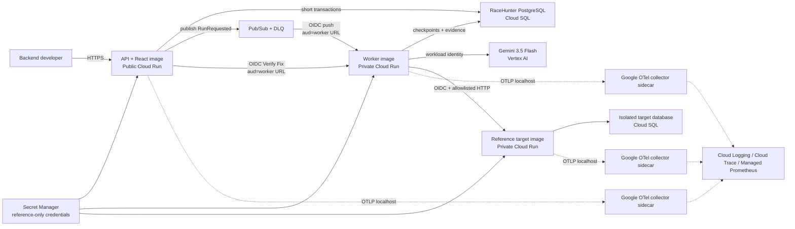

# RaceHunter System Context

RaceHunter is a Docker-first modular monolith with exactly three application images. The public API serves React and persists intent. Authenticated Pub/Sub push invokes the private worker. API Verify Fix calls and worker target calls use workload-identity OIDC tokens whose audiences are the exact private Cloud Run service URLs. PostgreSQL is authoritative; deterministic code alone verifies findings.

## Trust and cost boundaries

- Only the API grants `allUsers` invocation for the judge sandbox. Worker and target retain routable `run.app` ingress because no VPC route is provisioned, but invoker IAM is service-account scoped and unauthenticated requests are denied before application code.
- Pub/Sub signs an OIDC token for the exact worker audience. The API and worker acquire identity tokens from the Google metadata server and attach them only when the destination scheme, host, and port match the configured audience.
- Manual targets are absent from the public UI and hidden behind a local/admin bearer credential. Configuration requires ownership acknowledgement, exact host allowlisting, HTTPS, public DNS answers, allowlisted paths, sensitive JSON paths, and a Secret Manager version reference. Raw credentials are rejected.
- Automatic redirects are disabled. Every destination and redirect is revalidated; loopback, private, link-local, metadata, multicast, and mixed public/private DNS answers are blocked.
- Public hunts remain capped at 10 actors, 40 requests, 5 model calls, and 90 seconds. Authenticated experiments support 100 logical actors while global, target, and experiment semaphores independently cap active work.
- API and target have configurable hard maximum instance counts of at most two; the worker is fixed at one instance and one inbound request so process semaphores remain deployment-global. Both isolated Cloud SQL instances use the smallest staging tier with deletion protection, and a mandatory billing-budget alert reports 50%, 90%, and 100% thresholds.

## Provisioning boundaries

The staging infrastructure has two Terraform roots. The protected foundation root enables the exact required Google APIs and creates the private versioned state bucket and immutable Artifact Registry repository. The application root consumes repository-qualified immutable application digests and owns Cloud Run, Pub/Sub/DLQ, two credential-isolated Cloud SQL instances, Secret Manager references, workload IAM, and the mandatory budget. Foundation and application state use distinct GCS prefixes.

The transition from local bootstrap state to GCS is an explicit operator step after a fresh Foundation approval: materialize the gitignored backend template, execute the descriptor's exact `init -migrate-state` arguments for bootstrap, then configure the application backend with its exact `init -reconfigure` arguments. Application planning materializes the exact reviewed inputs into a gitignored `.tfvars.json`, hashes those bytes, saves the plan, and binds deployment to that saved-plan hash. Any drift requires a new plan and approval.

These are locally validated contracts. No remote bucket, repository, IAM policy, database, revision, or audience has yet been observed by this phase, and collector-image digest resolution is deferred until explicit network authorization.

## Correlation path

ASP.NET Core and `HttpClient` OpenTelemetry instrumentation carry W3C context across API → Pub/Sub → worker → target/model/replay calls. RaceHunter spans add correlation tags for work, run, attempt, actor, step, request, model invocation, finding, and artifact identifiers. The same dimensions feed counters and latency histograms. Request logging includes correlation IDs but never bodies, authorization headers, cookies, target credentials, or configured sensitive JSON paths. Terraform mounts a non-secret collector configuration and sets `OTEL_EXPORTER_OTLP_ENDPOINT=http://localhost:4317` for each service; Google-built sidecars export traces to Cloud Trace and metrics to Managed Service for Prometheus. Compose export remains opt-in.

The same API, worker, and reference-target Dockerfiles are used by Docker Compose and Terraform. Terraform is validated locally without credentials; apply and deployed smoke remain explicit approval gates because they create or contact Google Cloud resources.
