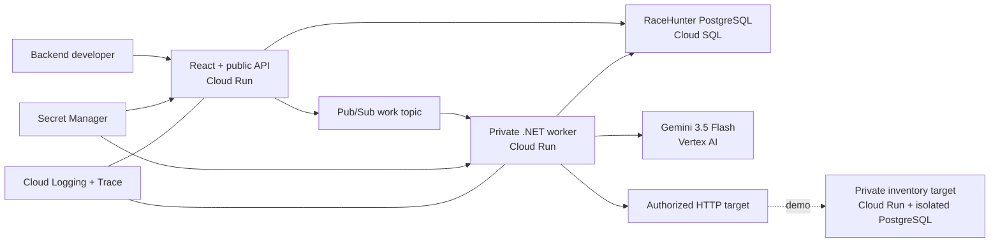

# RaceHunter System Context

RaceHunter is a Docker-first modular monolith with three independently deployable images. The public API serves the React client and persists intent. Authenticated Pub/Sub push invokes the private worker. The worker owns long-running campaigns, invokes Gemini through Vertex AI, and calls only authorized targets. PostgreSQL is authoritative for lifecycle state and evidence; the reference target uses an isolated database.

The same API, worker, and reference-target Dockerfiles are used by Docker Compose and Terraform. Cloud deployment is intentionally not performed without explicit approval because it creates billable resources.
